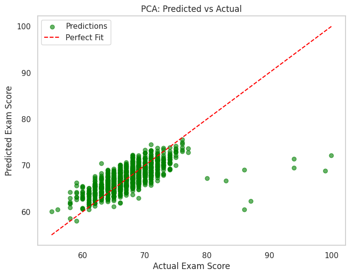

<script id="MathJax-script" async src="https://cdn.jsdelivr.net/npm/mathjax@3/es5/tex-mml-chtml.js"></script>

## Predicting Student Performance Based on Various Statistics

Xuanzhe Han

***

## Introduction 

Education is crucial to every person. It equips people with knowledge, critical thinking, and other skills that are vital to people’s success in their professional lives, self-discovery, and personal growth. In recent years, with the rapid growth in technology and the high demand of specialized knowledge, education has become increasingly important for people to be able to navigate complex problems and find career success. Children, however, may not understand the importance of education. They may make mistakes that will have long lasting consequences. It is thus crucial to aid students in their early education and help guide them on the right path. There are different factors that affect students’ performance in school, including their family background, mental illnesses, disabilities, sleep hours, attendance rate, and peer-influence name a few. If we can use machine learning to identify struggling students, we can provide early intervention and implement strategies to better help them, thus improving school’s resource allocation and improve equity in education.

From empirical evidence and common-sense judgement, we can reasonably postulate that there exists a relatively linear relationship between various factors mentioned above and student performance, and the relationship can be easily modeled by even relatively traditional machine learning models like linear regression. In fact, this topic has been extensively researched. For example, Charalampos Dervenis, Vasileios Kyriatzis, Panos Fitsilis, and Spyros Stoufis from University of  Thessaly used SVM, KNN, and Random Forest Learner to predict student grades [1], and Murat Pojon from the University of Tampere used Linear Regression and Naïve Baye’s Classifier in addition to Decision Tree to model student performance [2]. These researchers all found varying success in achieving high accuracy in their resulting models. In this project, I utilized two machine learning models, ridge regression and neural network, to show that it is straightforward to train a model to predict a student’s grade with reasonable performance.


## Data

Student performance can be multifaceted. To have a clear target variable, I chose to use final exam score as the metric to determine performance. Student Performance Factors dataset from Kaggle [3] is used for this project. This dataset contains 20 features that influence academic performance.

| Factor                        | Description                                                                 |
|-------------------------------|-----------------------------------------------------------------------------|
| Hours studied                  | Number of hours spent studying per week                                      |
| Attendance                     | Percentage of classes attended                                               |
| Parental involvement           | Level of parental involvement in student’s education (low, medium, high)     |
| Extracurricular activities     | Participation in extracurricular activities (yes, no)                        |
| Access to resources            | Availability of educational resources (low, medium, high)                   |
| Sleep hours                    | Average number of hours of sleep per night                                   |
| Previous scores                | Scores from previous exams                                                   |
| Motivation level               | Student's level of motivation (low, medium, high)                           |
| Internet access                | Availability of internet access (yes, no)                                   |
| Tutoring sessions              | Number of tutoring sessions attended per month                               |
| Family income                  | Family income level (low, medium, high)                                      |
| Teacher quality                | Quality of the teachers (low, medium, high)                                  |
| School type                    | Type of school attended (public, private)                                    |
| Peer influence                 | Influence of peers on academic performance (positive, neutral, negative)     |
| Physical activity              | Average number of hours of physical activity per week                        |
| Learning disabilities          | Presence of learning disabilities (yes, no)                                  |
| Parental education level       | Highest education level of parents (high school, college, postgraduate)      |
| Distance from home             | Distance from home to school (near, moderate, far)                           |
| Gender                         | Student’s gender (male, female)                                              |
| Exam score                     | Final exam score                          

*Table 1: Dataset columns description [3].*

This dataset is synthetic but it is used extensively for analytical purposes. It is a good representation of realistic scenarios and is sufficient for the purpose of this project to demonstrate the feasibility of the machine learning models used. I use exam score as the target value, and other 19 features as input. The goal is to have a reasonable prediction of the score students get on exams.

After importing the data, some sample graphs can be generated to confirm that these features are associated with students' academic performance. The below graphs show that there is a correlation between students scoring higher on final exams and attending extracurricular activities and going to a private school. 

<table>
  <tr>
    <td style="width:33%; text-align:center;"></td>
    <td style="width:33%; text-align:center;"></td>
  </tr>
</table>

*Figure 1: Bar plot of sample data*

It is difficult for a human to judge the exact final exam score based on these features alone, but a reasonable estimation can be made from the observable patterns.

The dataset is randomized and split into 80% for training and 20% for testing for all models.

## Ridge Regression
#### Overview
It is reasonable to assume from common knowledge and logic that the relationship between features like hours spent on studying and access to resources have a relatively linear relationship with students' exam scores. Thus a linear machine learning model is a good choice for this task.

Ridge regression, a regularized version of linear regression, works by minimizing residual sum of squares. This model works well for this dataset since it introduces an additional term to penalize large weights, which helps prevent overfitting. Our dataset contains a large number of features, and may exhibit multicollinearity, and Ridge Regression works well to address these concerns. Compared to Linear Regression, Ridge Regression can shrink weights of less important features and prevent overfitting, which improves generalization.

The loss function of ridge regression is:
<p>
\[
L(\beta) = \sum_{i=1}^{n} \left( y_i - \hat{y}_i \right)^2 + \lambda \sum_{j=1}^{p} \beta_j^2
\]
</p>
Where:
<p>
- \( y_i \) is the actual value for the \( i \)-th sample
</p>
<p>
- \( \hat{y}_i \) is the predicted value for the \( i \)-th sample
</p>
<p>
- \( \beta_j \) are the weights of the model
</p>
<p>
- \( \lambda \) is the regularization parameter
</p>
Using the Scikit-Learn library, we can create a Ridge Regression model easily and train it on our dataset

```python
from sklearn.model_selection import train_test_split
from sklearn.linear_model import Ridge
from sklearn.metrics import mean_squared_error, r2_score
from sklearn.pipeline import Pipeline
from sklearn.preprocessing import StandardScaler
ridge_pipeline = Pipeline([
    ('scaler', StandardScaler()),   
    ('ridge', Ridge(alpha=1.0))  
])

ridge_pipeline.fit(X_train, y_train)
y_pred_ridge = ridge_pipeline.predict(X_test)
```

#### Results
After training and testing the model, REC curve and precision-recall curve are graphed.The precision-recall curve is graphed by counting the scores above median as true and scores below median as false.
<table>
  <tr>
    <td style="width:33%; text-align:center;"></td>
    <td style="width:33%; text-align:center;"></td>
    <td style="width:33%; text-align:center;"></td>
  </tr>
</table>

*Figure 2: Performance graphs of Ridge Regression*
From the result, it can be observed that a simple linear model like this can in fact achieve reasonably high performance, with a RMSE of only 2.038, and a precision of over 99.29% if predicted scores that are within range of ±2 points from the real score to be true.

#### Discussion
A traditional linear machine learning model can clearly do very well in predicting final exam scores and thus judge a student's potential academic performance given the input features in the dataset. This is not surprising based on our empirical analysis and the simple fact that the dataset contains a comprehensive list of input features, a fact which will be explored later with PCA.

This model can then be used as a baseline for the other tests that will be performed.

## Neural Network
#### Overview
Just for testing, I trained a very basic neural network with a classic four layer neural network consisting of an input layer with 64 neurons with ReLU activation function, a dropout layer, a hidden layer with 32 neurons and using ReLU function again, and an output layer with a linear activation function. Adam optimizer is used for training since it is a popular optimization algorithm combining the benefits of both AdaGrad and RMSProp. It adjusts the learning rate for each parameter individually, uses momentum to accelerate the training process and avoid falls into local minimums, and is computationally efficient.  Mean Absolute Error is used to evaluate the model's performance. 

The ReLU activation function is:
<p>
\[ReLU(x) = max(0, x)\] 
And MAE is calculated as 
\[MAE = (1/n) * Σ |y_i - ŷ_i|\]
</p>
Where:
<p>
- \( y_i \) is the actual value for the \(i\)-th data point
</p>
<p>
- \( \hat{y}_i \) is the predicted value for the \(i\)-th data point
</p>
<p>
- \( n \) is the total number of data points
</p>
The loss function of ridge regression is:
<p>
\[
L(\beta) = \sum_{i=1}^{n} \left( y_i - \hat{y}_i \right)^2 + \lambda \sum_{j=1}^{p} \beta_j^2
\]
</p>
Where:
<p>
- \( y_i \) is the actual value for the \( i \)-th sample
</p>
<p>
- \( \hat{y}_i \) is the predicted value for the \( i \)-th sample
</p>
<p>
- \( \beta_j \) are the weights of the model
</p>
<p>
- \( \lambda \) is the regularization parameter
</p>
Using the TensorFlow Keras library, we can construct the neural network

```python
import tensorflow as tf
from tensorflow.keras.models import Sequential
from tensorflow.keras.layers import Dense, Dropout
from tensorflow.keras.optimizers import Adam


model = Sequential([
  Dense(64, input_dim=X_train_scaled.shape[1], activation='relu'), 
  Dropout(0.25), 
  Dense(32, input_dim=X_train_scaled.shape[1], activation='relu'), 
  Dense(1, activation='linear')
])

model.compile(optimizer=Adam(learning_rate=0.003), loss='mse', metrics=['mae'])

history = model.fit(
  X_train_scaled, y_train_scaled,
  validation_data=(X_test_scaled, y_test_scaled),
  epochs=6,
  batch_size=32,
  verbose=1
)

y_pred_scaled = model.predict(X_test_scaled)
y_pred = scaler_y.inverse_transform(y_pred_scaled)
```
After some adjustments, the learning rate is set to 0.003 and the dropout rate is set to 0.25, and the neural network is trained for 6 epochs.

#### Results
The same graphs are created using the same methods as before
<table>
  <tr>
    <td style="width:33%; text-align:center;"></td>
    <td style="width:33%; text-align:center;"></td>
    <td style="width:33%; text-align:center;"></td>
  </tr>
</table>

*Figure 3: Performance graphs of Neural Network*
From the result, as expected, there are minimal if any improvements. The RMSE is 2.0905, and accuracy is at 99.29% using the same metric as Ridge Regression.

#### Discussion
Obviously, using a neural network to model this simple linear relationship is an overkill. It is completely unnecessary, and since the Ridge Regression already does an excellent job at predicting the correct score, the neural network saw almost no improvements and is significantly more computationally demanding to train. It also relies heavily on tuning. Wrong values for hyperparameters like learning rate, dropout rate, and epochs can lead to significantly worse performance compared to linear machine learning models, and this marginally better result was achieved only through tweaking the parameters. 

## PCA
#### Overview
As mentioned before, the dataset contains a comprehensive list of features, which prompts the question of whether they are all needed. I hence used PCA on the original dataset and used Ridge Regression again to see the performance. PCA will ideally reduce the dimensionality of the original dataset and keep only essential data, effectively compressing the dataset. 

Using the Scikit-Learn library, we can perform PCA on the original dataset to see how many components we need to maintain 90% cumulative variance, which allows for an informative representation of the original data.

```python
from sklearn.decomposition import PCA

scaler = StandardScaler()
X_scaled = scaler.fit_transform(X)

pca = PCA()
X_pca = pca.fit_transform(X_scaled)

explained_variance = pca.explained_variance_ratio_

plt.figure(figsize=(8, 5))
plt.plot(np.cumsum(explained_variance), marker='o', linestyle='--')
plt.title('Variance by Number of Principal Components')
plt.xlabel('Number of Principal Components')
plt.ylabel('Variance')
plt.grid()
plt.show()

n_components = np.argmax(np.cumsum(explained_variance) >= 0.9) + 1
print(f"Number of components to retain 90% variance: {n_components}")

pca_final = PCA(n_components=n_components)
X_reduced = pca_final.fit_transform(X_scaled)
```

#### Results
Surprisingly, to maintain 90% cumulative variance, 17 principal components are needed, which is a far cry from reducing the dataset by a substantial amount. By using Ridge Regression with only 17 principal components, a noticeable performance degradation can already be observed, since RMSE becomes 2.8954. Accuracy is still reasonable but significant lower at 62.14% using the same metric of a tolerance of 2 points. That tolerance needs to be increased to more than 6 to see similar performance, which is acceptable.
<table>
  <tr>
    <td style="width:33%; text-align:center;"></td>
    <td style="width:33%; text-align:center;"></td>
    <td style="width:33%; text-align:center;"></td>
  </tr>
</table>

*Figure 4: Performance graphs of Ridge Regression with 17 Principal Components*
If only 10 principal components are used, a parameter I originally had in mind, we see a major decrease in performance, with RMSE of 3.378 and accuracy of only 52.19%, not much better than guessing. However, it can be argued that it doesn't perform much worse than 17 principal components in a real-world setting since increasing the threshold metric to 6 points will see similar accuracy between two models. 
<table>
  <tr>
    <td style="width:33%; text-align:center;"></td>
    <td style="width:33%; text-align:center;"></td>
    <td style="width:33%; text-align:center;"></td>
  </tr>
</table>

*Figure 5: Performance graphs of Ridge Regression with 10 Principal Components*
#### Discussion
Surprisingly, every feature important and informative in the original dataset, which makes sense in hindsight since the dataset is highly synthetic and the features chosen are all major factors that will affect a student's performance.

## Conclusion
Student performance, as shown, can be easily predicted by various machine learning models trained on relatively small data samples using a few input features. This means machine learning models can potentially be used in schools, especially in mandatory education, to identify and help at-risk students. 

A good model to use for this purpose is a linear machine learning model. This project only explored Ridge Regression and Neural Networks, but other models like Decision Trees can potentially also be utilized to varying degrees of success. 

For more robust results, more research needs to be conducted in a real-world setting, and student performance obviously is not only exam scores, but also other more intangible metrics like percentage of knowledge retained and mental growth. These need to be quantified, and with other more obscure features like sexuality, religious beliefs, more complex models like Neural Networks and preprocessing methods like PCA can be used to model these less linear relationships that may be difficult for even humans to judge.

## References
[1] Charalampos Dervenis, Vasileios Kyriatzis, Spyros Stoufis, and Panos Fitsilis. 2023. Predicting Students' Performance Using Machine Learning Algorithms. In Proceedings of the 6th International Conference on Algorithms, Computing and Systems (ICACS '22). Association for Computing Machinery, New York, NY, USA, Article 6, 1–7. https://doi.org/10.1145/3564982.3564990

[2] Murat Pojon, 2017. Using Machine Learning to Predict Student Performance (2017). https://trepo.tuni.fi/handle/10024/101646

[3] Student Performance Factors, Kaggle. https://www.kaggle.com/datasets/lainguyn123/student-performance-factors?resource=download

[back](./)

